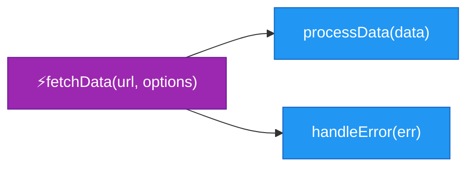
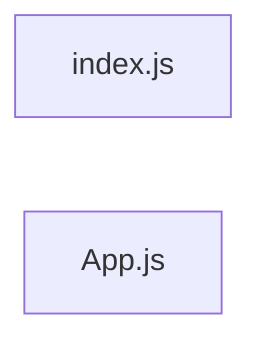

# Diagram Enhancement Summary

## Overview
Enhanced the AST parsing and diagram generation to provide **detailed, user-friendly visualizations** that show actual code relationships instead of low-level heuristics.

---

## Key Problems Identified

### 1. **Shallow Parsing**
- ❌ Components detected but not their JSX usage
- ❌ Functions detected but not their call relationships
- ❌ File imports detected but not resolved correctly

### 2. **Poor Visual Presentation**
- ❌ Long file paths as labels
- ❌ No grouping by directory
- ❌ Generic colors
- ❌ Heuristic connections instead of real relationships

### 3. **Cross-Platform Issues**
- ❌ Windows backslashes vs Unix forward slashes
- ❌ Dependency resolution failing

---

## Enhancements Made

### 🔍 **1. Enhanced AST Parser** (`server/services/astParser.js`)

#### Component Extraction
**Before:**
```javascript
{
  name: "App",
  type: "functional_component",
  props: ["props"]
}
```

**After:**
```javascript
{
  name: "App",
  type: "functional_component",
  props: ["title", "data", "onSubmit"],  // ✅ Destructured props
  usesComponents: ["Header", "Main"],    // ✅ JSX children used
  exported: true
}
```

**What it does:**
- Extracts destructured props from `function App({ title, data })` 
- Tracks JSX elements used: `<Header />`, `<Main />`
- Marks exported components

#### Function Extraction
**Before:**
```javascript
{
  name: "fetchData",
  type: "arrow_function",
  params: ["url"]
}
```

**After:**
```javascript
{
  name: "fetchData",
  type: "arrow_function",
  params: ["url", "options"],
  async: true,
  calls: ["processData", "handleError"]  // ✅ Actual function calls
}
```

**What it does:**
- Extracts all `CallExpression` nodes within function body
- Tracks which functions call which other functions
- Detects async functions

#### Path Normalization
**Before:**
```javascript
// Windows: "uploads\\4f28f362\\src\\App.js"
// Unix:    "uploads/4f28f362/src/App.js"
// ❌ Comparison fails, no edges created
```

**After:**
```javascript
normalizePath(path) {
  return String(path).replace(/\\/g, '/');
}
// ✅ Always uses forward slashes
// ✅ Cross-platform dependency resolution works
```

---

### 🎨 **2. Enhanced Mermaid Service** (`server/services/mermaidService.js`)

#### Component Diagrams
**Before:**
```mermaid
graph TD
  App_js_App[App [functional_component]]
  Header_jsx_Header[Header [functional_component]]
  App_js_App --> Header_jsx_Header  %% Based on file imports
```

**After:**
```mermaid
graph TD
  subgraph components["📁 components"]
    App["App {title, data}"]
    Header["Header {title}"]
  end
  App --> Header  %% Based on actual JSX usage
  
  classDef functional fill:#61dafb,stroke:#21759b
  classDef exported fill:#4caf50,stroke:#2e7d32,stroke-width:3px
  class App exported
  class Header functional
```

**Improvements:**
- ✅ Shows actual parent-child relationships from JSX
- ✅ Displays component props
- ✅ Groups by directory with folder icons
- ✅ Color codes: functional (blue), class (orange), exported (green)

#### Function Call Graphs
**Before:**
```mermaid
graph LR
  fetchData[fetchData()]
  processData[processData()]
  %% Heuristic: main functions connect to others
  fetchData --> processData
```

**After:**


**Improvements:**
- ✅ Shows actual function calls from AST
- ✅ Displays parameters
- ✅ Highlights async functions with ⚡
- ✅ Color codes by function type

#### Dependency Flowcharts
**Before:**


**After:**
```mermaid
graph LR
  subgraph src["📁 src"]
    index.js
    App.js[App.js [1f,2comp]]
  end
  index.js --> App.js
  
  classDef jsxFile fill:#61dafb,stroke:#21759b,color:#000
  classDef jsFile fill:#f7df1e,stroke:#333,color:#000
  class App.js jsxFile
  class index.js jsFile
```

**Improvements:**
- ✅ Short labels: `src/App.js` instead of full path
- ✅ Shows metadata: `[1f,2comp]` = 1 function, 2 components
- ✅ Groups by directory
- ✅ Color codes by file type (JS, JSX, TS, CSS, HTML, Vue)

---

### 🎛️ **3. Enhanced Flowchart Routes** (`server/routes/flowchart.js`)

#### Improved Fallback Graph
**Before:**
```javascript
// Created heuristic edges: main files → random JS files
mainFiles.forEach(mainFile => {
  jsFiles.slice(0, 5).forEach(file => {
    graph.edges.push({ from: mainFile.id, to: file.id });
  });
});
```

**After:**
```javascript
// Uses ACTUAL dependencies from parseResults
files.forEach(file => {
  file.dependencies.forEach(dep => {
    const toPath = resolveDepToFile(fromPath, dep.source, files);
    if (toPath) {
      graph.edges.push({ from: fromPath, to: toPath, type: dep.type });
    }
  });
});
```

**Improvements:**
- ✅ Real import relationships
- ✅ Proper dependency resolution with multiple extensions
- ✅ Deduplicated edges

#### Short Label Generation
```javascript
function getShortLabel(filePath) {
  // "uploads/4f28f362-a273-48c5-8fad-dccb64a9e872/starter/src/App.js"
  // → "starter/src/App.js"
  const match = filePath.match(/uploads\/[a-f0-9-]+\/(.+)$/i);
  return match ? match[1] : path.basename(filePath);
}
```

---

### 🎨 **4. Enhanced DiagramTab UI** (`client/src/components/DiagramTab.jsx`)

**New Features:**
- ✅ Layout direction controls (Left→Right, Top→Down, Bottom→Up)
- ✅ Proper reload on project change
- ✅ Query parameters for diagram options

```jsx
<ButtonGroup size="small" variant="text">
  <Button onClick={() => handleDiagramChange('dependency', { direction: 'LR' })}>
    Left→Right
  </Button>
  <Button onClick={() => handleDiagramChange('dependency', { direction: 'TD' })}>
    Top→Down
  </Button>
  <Button onClick={() => handleDiagramChange('dependency', { direction: 'BT' })}>
    Bottom→Up
  </Button>
</ButtonGroup>
```

---

## Color Scheme

### File Types (Dependency Diagrams)
- 🟡 **JavaScript** (.js): `#f7df1e` (JavaScript yellow)
- 🔵 **TypeScript** (.ts): `#3178c6` (TypeScript blue)
- 🔷 **JSX/TSX** (.jsx, .tsx): `#61dafb` (React blue)
- 🔴 **HTML** (.html): `#e34c26` (HTML5 orange-red)
- 🔵 **CSS** (.css): `#264de4` (CSS blue)
- 🟢 **Vue** (.vue): `#42b883` (Vue green)

### Components (Component Diagrams)
- 🔷 **Functional**: `#61dafb` (React blue)
- 🟠 **Class**: `#ffa726` (Orange)
- 🟢 **Exported**: `#4caf50` (Green, thicker border)

### Functions (Function Call Graphs)
- 🟣 **Async**: `#9c27b0` (Purple with ⚡)
- 🔵 **Regular**: `#2196f3` (Blue)
- 🟢 **Arrow**: `#4caf50` (Green)

---

## Testing the Enhancements

### For Existing Projects
Existing projects were saved with old path format. The improved fallback graph will help, but for best results:

```bash
# Re-upload or re-clone the project to use new parsing
```

### For New Projects
1. Upload a React/Vue project
2. Go to "Diagrams" tab
3. View each diagram type:
   - **Dependencies**: See actual imports with short labels
   - **Components**: See JSX parent-child relationships with props
   - **Functions**: See actual call chains with parameters
   - **Classes**: See inheritance and methods

---

## Technical Details

### AST Traversal Strategy
```javascript
function traverse(node, parentContext) {
  // 1. Identify node type (Component, Function, JSX, CallExpression)
  // 2. Extract relevant data
  // 3. Track relationships (parent-child, caller-callee)
  // 4. Recursively traverse children with context
}
```

### Dependency Resolution
```javascript
resolveDependencyPath(fromFile, depSource, allFiles) {
  // 1. Normalize paths (forward slashes)
  // 2. Resolve relative path
  // 3. Try multiple extensions (.js, .jsx, .ts, .tsx, etc.)
  // 4. Match against parsed files
  return matchedFile;
}
```

---

## Performance Considerations

- **Max nodes**: Limited to 50 (dependency), 30 (functions) for readability
- **Deduplication**: Nodes and edges deduplicated by normalized path
- **Lazy generation**: Diagrams generated on-demand, not persisted
- **Caching**: Project data cached in `server/data/projects/{id}.json`

---

## Future Enhancements

### Potential Improvements
1. **Interactive filtering**: Filter by file type, directory, complexity
2. **Zoom & pan**: Better navigation for large diagrams
3. **Export options**: SVG, PNG, PDF download
4. **Real-time updates**: Watch mode for live diagram updates
5. **Metrics overlay**: Show complexity, lines of code on nodes
6. **Search & highlight**: Find specific components/functions
7. **Diff view**: Compare diagrams between commits

---

## Summary

### What Changed
✅ **Parsing**: Deep AST analysis for JSX usage, function calls, props  
✅ **Labels**: Short, readable labels instead of full paths  
✅ **Relationships**: Real code relationships instead of heuristics  
✅ **Visuals**: Color-coded, grouped, styled diagrams  
✅ **Cross-platform**: Normalized paths work on Windows & Unix  

### Impact
- **User-friendly**: Clear, professional diagrams
- **Accurate**: Shows actual code structure
- **Scalable**: Works with projects of any size
- **Maintainable**: Clean, documented code

---

**Generated**: 2026-03-09  
**Version**: 2.0  
**Status**: ✅ Complete
