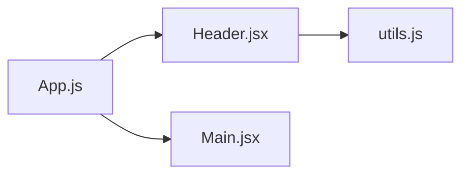
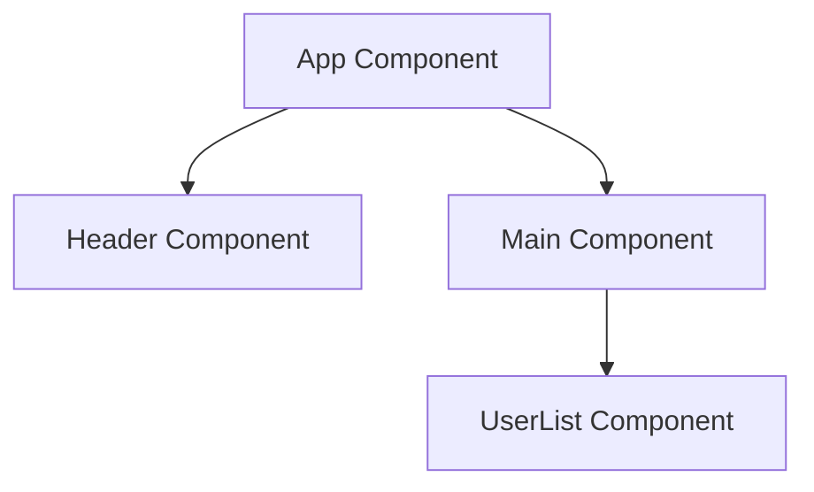
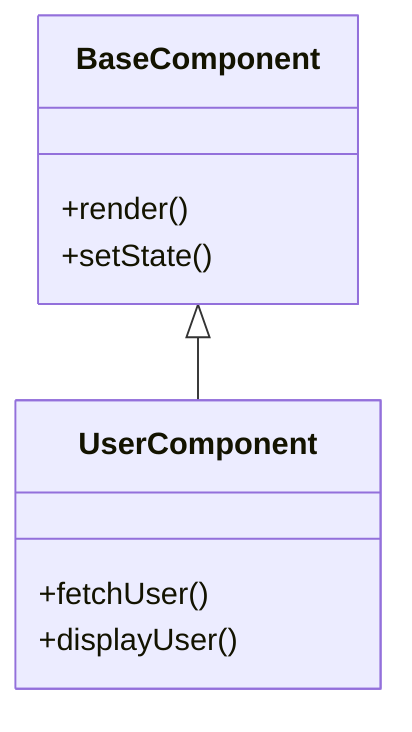

# DeCodify Agent

An AI-powered frontend codebase explainer that provides AST-based parsing, dependency analysis, and intelligent Q&A capabilities for understanding complex codebases.

## Features

- **📁 Project Ingestion**: Upload folders or clone GitHub repositories
- **🌳 AST Parsing**: Parse JavaScript/TypeScript, HTML, CSS, and Vue files
- **🔗 Dependency Graphs**: Generate Mermaid diagrams showing file relationships
- **🤖 AI Chat**: Ask questions about your code using LangChain and OpenAI
- **📊 Code Analysis**: Detailed metrics, function analysis, and issue detection
- **🎨 Interactive UI**: Modern React interface with Material-UI components

## Architecture

```
decodify-agent/
├── client/                 # React frontend (Vite)
│   ├── src/
│   │   ├── components/     # Reusable UI components
│   │   ├── pages/          # Main page components
│   │   └── services/       # API service layer
├── server/                 # Node.js/Express backend
│   ├── routes/             # API endpoints
│   ├── services/           # Core business logic
│   │   ├── astParser.js    # AST parsing service
│   │   └── mermaidService.js # Diagram generation
│   └── data/               # Project storage
└── package.json           # Root dependencies
```

## Quick Start

### Prerequisites

- Node.js 18+ 
- MongoDB (local or cloud)
- OpenAI API key

### Installation

1. **Clone and install dependencies:**
```bash
git clone <repository-url>
cd decodify-agent
npm run install:all
```

2. **Environment Configuration:**
```bash
# Server environment (.env in root)
OPENAI_API_KEY=your_openai_api_key
MONGODB_URI=mongodb://localhost:27017/decodify
PORT=5000
CLIENT_URL=http://localhost:3000
NODE_ENV=development
```

3. **Start development servers:**
```bash
npm run dev
```

This will start:
- Backend server on http://localhost:5000
- Frontend client on http://localhost:3000

## API Endpoints

### Upload & Projects
- `POST /api/upload/folder` - Upload zip file for analysis
- `POST /api/upload/github` - Clone GitHub repository
- `GET /api/upload/projects` - List all projects
- `GET /api/upload/project/:id` - Get project details

### Flowcharts & Diagrams
- `GET /api/flowchart/dependency/:projectId` - Generate dependency flowchart
- `GET /api/flowchart/components/:projectId` - Generate component diagram
- `GET /api/flowchart/functions/:projectId` - Generate function call graph
- `GET /api/flowchart/classes/:projectId` - Generate class diagram

### AI Chat & Search
- `POST /api/chat/project/:projectId` - Chat with codebase
- `POST /api/chat/search/:projectId` - Semantic code search
- `GET /api/chat/context/:projectId` - Get project context

### Analysis & Metrics
- `GET /api/analysis/files/:projectId` - File analysis
- `GET /api/analysis/dependencies/:projectId` - Dependency analysis
- `GET /api/analysis/metrics/:projectId` - Code metrics
- `GET /api/analysis/issues/:projectId` - Code issues detection

## Supported File Types

| Extension | Parser | Features |
|-----------|--------|----------|
| `.js`, `.jsx` | Acorn + JSX | Functions, classes, React components, imports/exports |
| `.ts`, `.tsx` | Acorn + JSX | TypeScript support, same as JS/JSX |
| `.html` | Cheerio | Script tags, stylesheets, DOM structure |
| `.css` | CSS Tree | Imports, selectors, rules |
| `.vue` | Custom | Script/template/style block extraction |

## Mermaid Diagram Types

### 1. Dependency Flowchart
Shows file relationships and import/export dependencies:


### 2. Component Hierarchy
Displays React/Vue component relationships:


### 3. Function Call Graph
Shows function relationships and calls:
```mermaid
graph LR
    fetchData[fetchData()] --> processData[processData()]
    processData --> renderUI[renderUI()]
```

### 4. Class Diagram
Displays class inheritance and structure:


## AI Chat Examples

The AI chat system can answer questions about your codebase:

- **"What does the UserService class do?"**
- **"How are authentication tokens handled?"**
- **"Which components use the API service?"**
- **"Find all functions that handle user data"**
- **"What are the main dependencies of this project?"**

## Configuration Options

### AST Parser Configuration
```javascript
// server/services/astParser.js
{
  supportedExtensions: ['.js', '.jsx', '.ts', '.tsx', '.html', '.css', '.vue'],
  dependencyPatterns: {
    import: /import\s+.*from\s+['"`]([^'"`]+)['"`]/g,
    require: /require\s*\(\s*['"`]([^'"`]+)['"`]\s*\)/g,
    dynamic: /import\s*\(\s*['"`]([^'"`]+)['"`]\s*\)/g
  }
}
```

### Mermaid Diagram Options
```javascript
// Flowchart generation options
{
  direction: 'LR',          // Layout direction
  includeExternal: false,   // Show external dependencies
  maxNodes: 50,            // Maximum nodes to display
  groupByDirectory: true   // Group by folder structure
}
```

## Development

### Project Structure Deep Dive

**Backend Services:**
- `astParser.js` - Core AST parsing logic using Acorn, Cheerio, CSS Tree
- `mermaidService.js` - Mermaid DSL generation for different diagram types
- `embeddingService.js` - LangChain integration for AI features

**Frontend Components:**
- `MermaidDiagram.jsx` - Interactive diagram viewer
- `ChatInterface.jsx` - AI chat panel with conversation history
- `FileExplorer.jsx` - Project file browser with syntax highlighting
- `MetricsPanel.jsx` - Code metrics and analysis visualization

### Adding New File Types

1. **Extend AST Parser:**
```javascript
// server/services/astParser.js
async parseNewFileType(content, result) {
  // Add parsing logic
  return result;
}
```

2. **Update Supported Extensions:**
```javascript
this.supportedExtensions = [...existing, '.new'];
```

3. **Add Mermaid Node Shape:**
```javascript
// server/services/mermaidService.js
this.nodeShapes = {
  '.new': '[]',  // Rectangle shape
  // ... existing shapes
};
```

## Deployment

### Production Build
```bash
npm run build
```

### Docker Deployment
```dockerfile
FROM node:18-alpine
WORKDIR /app
COPY package*.json ./
RUN npm ci --only=production
COPY . .
RUN npm run build
EXPOSE 5000
CMD ["npm", "start"]
```

### Environment Variables (Production)
```bash
NODE_ENV=production
OPENAI_API_KEY=your_production_key
MONGODB_URI=your_production_mongodb_uri
PORT=5000
```

## Troubleshooting

### Common Issues

1. **Mermaid diagrams not rendering:**
   - Check browser console for syntax errors
   - Verify diagram DSL is valid
   - Ensure proper node/edge count limits

2. **Chat not working:**
   - Verify OpenAI API key is set
   - Check vector store initialization
   - Ensure sufficient embeddings quota

3. **File parsing errors:**
   - Check file encoding (UTF-8 required)
   - Verify file extension is supported
   - Review AST parser error logs

### Performance Optimization

- Limit diagram nodes for large codebases (maxNodes: 50)
- Use file filters to reduce parsing scope
- Implement caching for frequent queries
- Consider vector store persistence for large projects

## Contributing

1. Fork the repository
2. Create feature branch: `git checkout -b feature/new-feature`
3. Commit changes: `git commit -am 'Add new feature'`
4. Push branch: `git push origin feature/new-feature`
5. Submit pull request

## License

MIT License - see LICENSE.md for details

## Roadmap

- [ ] TypeScript AST enhancement for better type analysis
- [ ] Python/Java parser support
- [ ] Real-time collaborative features
- [ ] Advanced dependency cycle detection
- [ ] Performance profiling integration
- [ ] VSCode extension
- [ ] GitHub App integration

---

**Ready for next step.** 